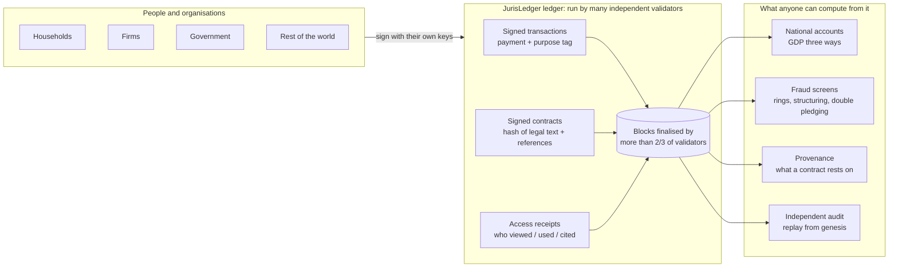
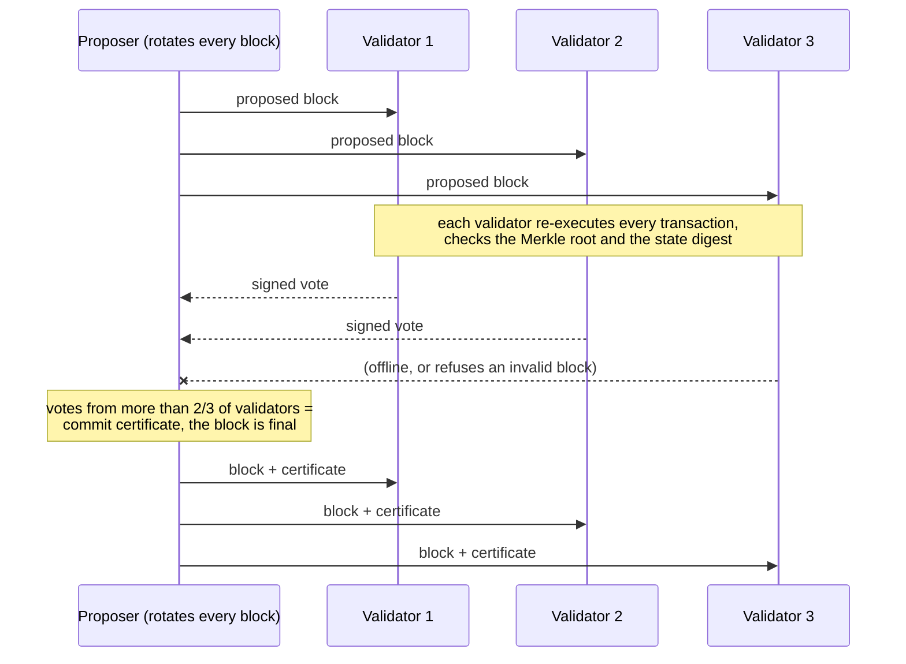
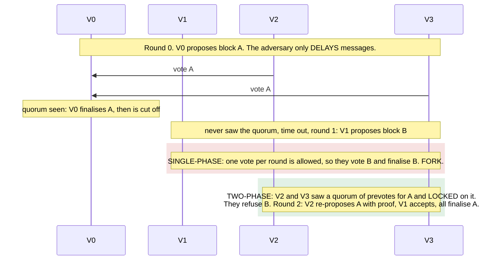
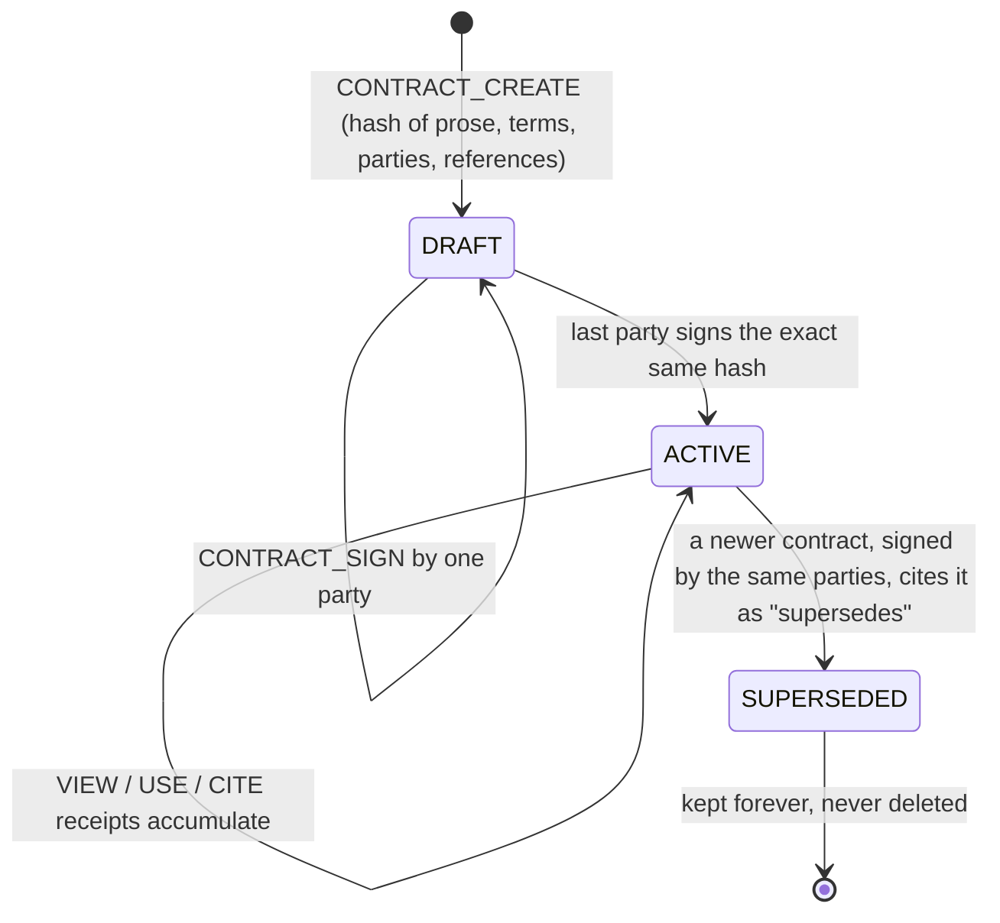
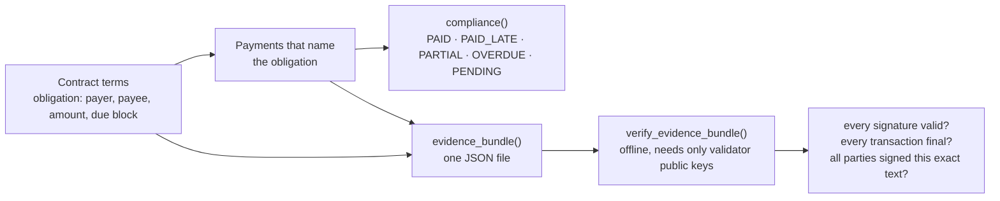
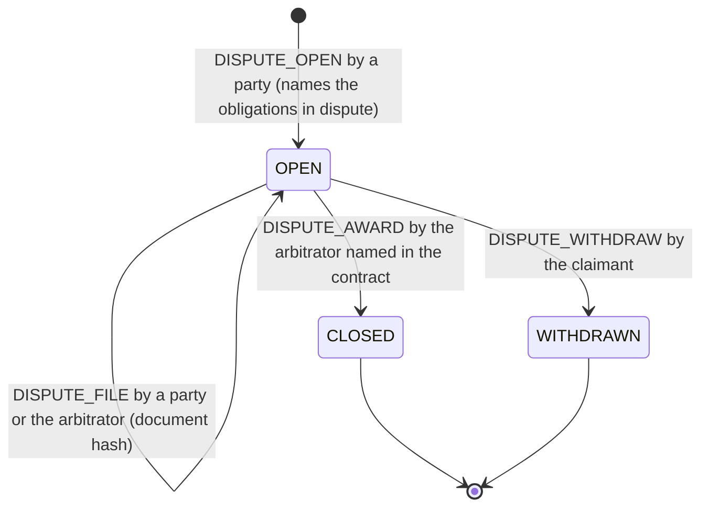
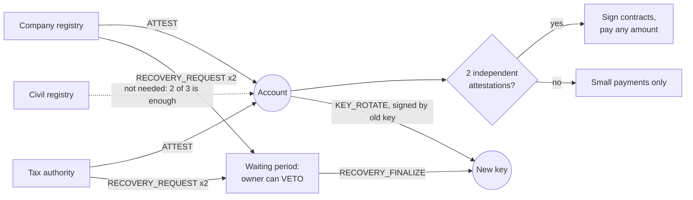
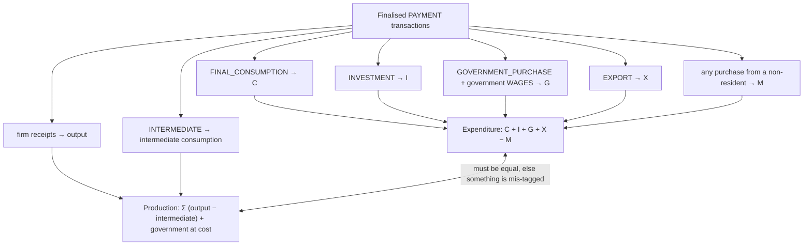

# JurisLedger

**Signed legal contracts and verifiable public accounts on a ledger nobody owns.** *Juris* is Latin for "of law", as in jurisprudence.

JurisLedger is a research framework with working code. It asks one question and answers it with running software instead of slogans:

> *If contracts and payments were recorded on a ledger that no single institution controls, could agreements become harder to forge and easier to prove, could fraud become harder to hide, and could a country measure its own economy more truthfully — without handing anyone a new kind of central power?*

Everything claimed in this README is backed by an experiment you can run in about half a minute:

```bash
python -m jurisledger all
```

```text
=== Obligations, compliance and court-ready evidence files ===
    instalment-1   due block 4  paid $500.00 of $500.00  settled at 3  -> PAID
    instalment-2   due block 6  paid $500.00 of $500.00  settled at 7  -> PAID_LATE
    instalment-3   due block 8  paid $0.00 of $500.00  settled at None  -> OVERDUE
  [PASS] an evidence file verifies offline with only the validators' public keys
  [PASS] changing an amount inside the evidence file is detected
  [PASS] enclosing a different contract text is detected
=== Adversarial experiments ===
  [PASS] a block containing a forged payment gets no honest votes
  [PASS] equivocation is proven on-chain and the validator is removed
=== Gross Domestic Product (GDP) measured from the ledger ===
  GDP expenditure : $2,196,332.41     ground truth    : $2,196,332.41
  ...
ALL CHECKS PASSED          (90 claims)
```

> **Status:** research prototype, version 0.6. It is a laboratory, not a payment system. Do not put real money or real personal data on it. The [limitations](#what-this-does-not-solve) section is part of the result, not fine print.

---

## The idea in one picture



In plain words:

1. **You sign what you do.** A payment or a contract is only valid with the digital signature of the person doing it. Nobody, including the people running the ledger, can create a payment from your account.
2. **Many parties check it, none controls it.** A block of transactions becomes final only when more than two thirds of the validators have independently re-run every rule and signed it.
3. **Payments say what they are for.** Each payment carries a purpose (consumption, investment, wages, export, …). The ledger *rejects* tags that do not fit the accounts involved, so statistics come out as simple sums.
4. **Contracts are legal text plus a fingerprint.** The readable contract is stored off the ledger; its cryptographic hash, its parties, its signatures, everything it cites, and every recorded view or use are on the ledger.
5. **Anyone can replay it.** The whole history can be re-verified from the first block by a statistics office, a court, a journalist or a competitor, without asking permission.

---

## Problems and what JurisLedger tries

| Problem today | What JurisLedger does | Code | Experiment that tests it |
|---|---|---|---|
| Contracts can be back-dated, swapped or quietly altered; nobody knows who relied on which version | Ricardian contracts: signed hash of the prose, machine-readable terms, typed references, supersession instead of deletion, receipted access log | `jurisledger/contracts.py` | `python -m jurisledger contracts` |
| "Did they pay on time?" is settled by whose records the judge believes | Payment duties are machine-readable terms; payments name the obligation they discharge; status (paid, late, partial, overdue) is computed from public data for any past date | `jurisledger/legal.py`, `jurisledger/state.py` | `python -m jurisledger legal` |
| Proving a digital agreement to an outsider means trusting whoever hosts the system | An *evidence file*: the signed transactions, Merkle paths and validator certificates for one contract, verifiable offline with nothing but the validators' public keys | `jurisledger/legal.py` | `python -m jurisledger legal` |
| When parties disagree, a platform operator or nobody at all decides | The contract itself names an arbitrator the parties chose. It acts only on a party's claim, once, only on the obligations in dispute, and can only reduce, postpone or waive — never increase, never move money | `jurisledger/state.py`, `jurisledger/legal.py` | `python -m jurisledger disputes` |
| Gross Domestic Product (GDP) is estimated from surveys and tax files, arrives late and gets revised for years | Payments carry validated purpose tags; GDP by expenditure, production and income become sums that must agree | `jurisledger/stats.py`, `jurisledger/state.py` | `python -m jurisledger gdp` |
| Statistics depend on trusting one producer | Anyone can recompute every figure from the public chain | `Chain.audit`, `jurisledger/stats.py` | `gdp`, `attacks` |
| A central operator can alter, censor or invent records | Byzantine-fault-tolerant quorum; validators have narrow, checkable powers and lose their seat if caught cheating | `jurisledger/chain.py`, `jurisledger/consensus.py` | `python -m jurisledger attacks` |
| Simple voting schemes quietly assume the network is reliable | A message-level simulator with an adversary that delays anything: single-phase voting forks with *no* dishonest validator; Tendermint-style two-phase voting with locks survives the same attack and 1,000 random ones The real ledger now runs on it, with every vote signed | `jurisledger/bft.py`, `jurisledger/ledgernet.py` | `asynchrony`, `integration` |
| Validators that only exist inside one simulator prove nothing about a deployment | Each validator is a separate process with its own key file and on-disk store, speaking signed frames over TCP; a killed node restarts from its store and catches up by re-verifying certificates from peers | `jurisledger/net.py`, `jurisledger/cluster.py` | `jurisledger cluster`, `tests/test_net.py` |
| Anyone can invent a thousand fake companies; one registrar is a single point of capture | Identity from *several independent issuers* (company registry, tax authority, civil registry…). Unverified accounts are capped; contracts need verified parties; validators can vote an issuer out | `jurisledger/state.py` | `python -m jurisledger identity` |
| Lose the key, lose everything — unacceptable for a public system | Owners rotate keys; lost keys are recovered by the issuers that know the person, after a waiting period in which the real owner can veto. Contracts, obligations and evidence follow the new key | `jurisledger/state.py`, `jurisledger/legal.py` | `python -m jurisledger identity` |
| Asymmetric information: each lender, buyer or regulator sees only its own slice | One shared record: a receivable pledged to two banks, or money moving in a circle, is a lookup instead of an investigation | `jurisledger/fraud.py` | `python -m jurisledger fraud` |
| A transparent ledger is a surveillance machine | Experimental: amounts hidden in Pedersen commitments whose *total* is still provable; differentially private sector statistics | `jurisledger/privacy.py`, `jurisledger/stats.py` | `python -m jurisledger privacy` |

---

## Quick start

Tested on Ubuntu (including Windows Subsystem for Linux 2) with Python 3.10 or newer.

```bash
git clone https://github.com/Normansrule/juris-ledger.git
cd juris-ledger
python3 -m venv .venv && source .venv/bin/activate
pip install -e ".[dev]"

jurisledger demo --out demo        # builds a sample ledger; then open demo/register.html in a browser
jurisledger audit demo/chain.json  # re-verify the whole ledger from its founding record
jurisledger verify demo/evidence-cold-storage-lease.json demo/validators.json
jurisledger cluster --out cluster  # four validator PROCESSES over TCP: pay, kill one, restart it, watch it catch up
jurisledger all                    # run all ten experiments (90 claims)
python -m pytest                   # 122 tests; every printed claim is also asserted
```

The only runtime dependency is [`cryptography`](https://cryptography.io) for Ed25519 signatures.

### Three tools for three kinds of people

| You are | You run | You get |
|---|---|---|
| A clerk, journalist or citizen | open `register.html` | A browsable public register: contracts and who opened them, obligations and their status, national accounts, review flags, validators. One self-contained file, no server, nothing fetched from the internet |
| A lawyer, arbitrator or auditor | `jurisledger verify evidence.json validators.json` | A plain-language verdict on one contract — who signed, what was paid and when, what the arbitrator decided — checked offline against validator keys *you* supply. Exit code 0 or 1, so it scripts |
| An operator | `jurisledger keygen`, `jurisledger node …`, `jurisledger status HOST:PORT` | One validator process per machine, listening on a port, storing blocks on disk; `jurisledger cluster` shows the whole choreography on one machine first |
| A statistics office, regulator or rival validator | `jurisledger audit chain.json` | The entire ledger replayed from its founding record: every signature, Merkle root, state digest and commit certificate |

## How it works

### 1. Transactions and the state machine

Every change is a signed transaction bound to a network (`chain_id`), an account and a counter (`nonce`), so it cannot be forged, replayed, or replayed on another network. `State.apply()` in [`jurisledger/state.py`](jurisledger/state.py) is the *only* code path that changes the ledger, and a failed transaction leaves no trace. Money is integer minor units; floating-point numbers are refused at serialisation.

| Transaction | What it records |
|---|---|
| `REGISTER` | A new household, firm, bank or non-resident. Government and validator identities cannot be self-declared |
| `PAYMENT` | Money moved, tagged with a purpose; optionally an invoice hash and the contract it is paid under |
| `CONTRACT_CREATE` / `CONTRACT_SIGN` | A contract's hash, terms, parties and references; each party's signature over the exact text |
| `CONTRACT_ACCESS` / `CONTRACT_GRANT` | A signed receipt that someone viewed or used a contract; permission for a third party to read a restricted one |
| `DISPUTE_OPEN` / `DISPUTE_FILE` / `DISPUTE_WITHDRAW` / `DISPUTE_AWARD` | A claim under the contract's arbitration clause, filings by hash, and the arbitrator's bounded decision |
| `ATTEST` / `ATTEST_REVOKE` | An accredited issuer vouches for an account (credential kept off-chain, hash on-chain), or withdraws it |
| `KEY_ROTATE` / `RECOVERY_REQUEST` / `RECOVERY_VETO` / `RECOVERY_FINALIZE` | Moving an account to a new key: by its owner at once, or by its issuers after a veto window |
| `EVIDENCE` | Proof that a validator signed two different blocks at the same height |
| `VALIDATOR_VOTE` | Validators voting to add or remove a validator or an identity issuer (needs the same two-thirds quorum) |

### 2. Blocks and finality without a central authority



This is the family of Practical Byzantine Fault Tolerance (PBFT) and Tendermint. With `n` validators, safety holds while fewer than one third misbehave. The validators could be, for example, a central bank, a statistics office, a court administration, commercial banks, universities and a civil-society auditor — chosen so that no single interest holds a third of the seats.

**Limited powers by design.** A validator can order valid transactions and delay them briefly. It cannot spend from an account, alter a contract, change a purpose tag, or finalise a block alone, because honest validators will not sign such a block and outsiders will not accept a block without a certificate.

### 3. Why two phases: consensus on a hostile network



`jurisledger/bft.py` runs both protocols over the *same* adversarial scheduler, and `jurisledger/ledgernet.py` drives the real chain with the two-phase one: proposals carry blocks, every vote is signed and checked, and a quorum of signed precommits is the block's certificate. The adversary forges nothing and drops nothing; it only chooses when messages arrive. That is enough to fork single-phase voting with four honest validators. The fix is the lock: any two quorums share an honest validator, and a locked validator will not help finalise a rival block. The experiment also shows the limit honestly: with two of four validators colluding, even two-phase voting forks, but every honest validator ends up holding the colluders' conflicting signatures, so the guilty are provable.

### 4. Contracts that are legal documents *and* data



Following Ian Grigg's *Ricardian contract*, the human-readable text stays off the ledger in a `ContractVault`; the ledger holds its SHA-256 hash. The vault hands out text only in exchange for a finalised, signed `CONTRACT_ACCESS` receipt, one receipt per read. That is how "who viewed it" becomes a fact instead of a server log someone can edit. References are typed (`cites`, `implements`, `amends`, `supersedes`) and can point to other contracts or to any external document by hash — a statute, a technical standard, an invoice.

### 5. Obligations and evidence a third party can check



The evidence file is the bridge to the existing legal system. An arbitrator does not need an account, a node, or trust in either party: the file either verifies against the published validator keys or it does not. Its limit is stated in the code and tested: a file proves what happened, never that nothing else happened. See [`docs/LEGAL.md`](docs/LEGAL.md).

### 6. Disputes: a referee with a short list of powers



The same "limited action" principle that binds validators binds the arbitrator. It is chosen by the parties inside the contract they all signed, may read a restricted contract (leaving a receipt like anyone else), and its award can only **reduce, postpone or waive** an obligation that is actually in dispute. While a dispute is open the obligation shows as `DISPUTED`, not `OVERDUE`. The ledger never seizes funds: after the award the debtor still pays with its own signature, and if it does not, the record says `OVERDUE` and the evidence file goes to a court.

### 7. Identity and keys for a public system



No single registrar decides who exists. Credentials stay off-chain with the issuer; only their hash is public. The same rule protects against a captured issuer in both directions: one corrupt issuer cannot create usable fake firms, and two colluding issuers who try to seize an account are stopped by the owner's veto during the waiting period.

### 8. National accounts as a by-product



The two totals come from different transactions, so their agreement is a genuine check. A hand-computed example lives in [`tests/test_stats_privacy.py`](tests/test_stats_privacy.py).

### 9. Fraud: prevented versus detected

| Made impossible by the protocol | Flagged for human review by `jurisledger/fraud.py` |
|---|---|
| Forged payments, replayed payments, double spending | Circular flows (round-tripping, wash trades, carousel tax fraud) |
| Altered or back-dated contracts, signing a different text | Structuring just under a reporting threshold |
| Mis-declared statistics tags (a household "government purchase") | Invented figures that fail Benford's first-digit law |
| Rewriting history | The same receivable pledged to several lenders |

The detectors report their false positives too; the experiment prints the flags raised on a *clean* economy before any fraud is injected.

---

## Who can attack it, and how far they get

| Adversary | Can do | Cannot do | Shown by |
|---|---|---|---|
| Outsider with no keys | Read public data, submit junk that is ignored | Move anyone's money, vote, register as government | `attacks` b, e |
| Account holder | Lie about *why* a payment was made within the tags its role allows | Overspend, replay, use tags reserved for other roles | `attacks` c, d, e |
| One malicious validator | Delay a victim's transaction by about one block; waste a round | Forge, censor permanently, fork honest nodes; equivocation costs it its seat | `attacks` b, f, g |
| Up to one third of validators offline | Slow the chain | Stop it | `attacks` h |
| One third or more refusing to vote | Halt the chain | Corrupt it — nothing false is ever finalised | `attacks` h |
| Someone on the wire | Read every frame; flood connections | Forge a vote or a transaction (all signed); make a node accept a block without a certificate | `test_net.py` |
| The network itself (delays, partitions, reordering) | Stall progress while the partition lasts; fork *single-phase* voting | Fork two-phase voting; forge or alter any message | `asynchrony` |
| One third or more of validators colluding | Fork even two-phase voting among cut-off honest validators | Do it deniably: their conflicting signatures convict them | `asynchrony` |
| Two thirds or more colluding | Finalise an invalid block among themselves | Make any honest auditor accept it: replay from genesis fails | `Chain.audit` |
| Creator of fake identities (Sybil attack) | Register any number of accounts for free | Sign a contract or move more than the cap without *k* independent issuers | `identity` |
| One corrupt identity issuer | Attest anyone; request recoveries | Make an account verified alone; seize an account (needs *k* issuers *and* the owner's silence through the veto window); survive a validator vote | `identity` |
| The arbitrator named in a contract | Reduce, postpone or waive a disputed obligation; read the contract (receipted) | Act without a party's claim, decide twice, increase a debt, touch undisputed terms, move money | `disputes` |
| Whoever stores the contract text | Refuse to serve it | Alter it undetected, or serve it without a receipt being owed | `contracts` |

Full treatment, including what is *not* defended: [`docs/THREAT_MODEL.md`](docs/THREAT_MODEL.md).

---

## What this does not solve

Stated plainly, because a framework that hides its gaps is a sales brochure.

1. **Off-ledger activity is invisible.** With 30 % of purchases in cash, the ledger captured 87 % of true GDP in our simulation. The ledger measures what is on it, exactly — not the economy, exactly.
2. **Honest-looking lies.** The protocol checks that a tag fits the *roles* involved, not that a firm's "investment" really was a machine and not a yacht. Cross-checks narrow this; they do not close it.
3. **Identity is a framework, not a solution.** The ledger enforces *k-of-n independent issuers*, revocation, recovery and governance over issuers. Whether the issuers check documents properly is outside the code, and if *k* issuers collude against an owner who is not watching during the veto window, they win.
4. **Privacy is unfinished.** The commitment scheme lacks range proofs, and our own experiment shows differential privacy is far too noisy for an economy of sixty firms (about 50 % error at ε = 1). It becomes usable only at national scale.
5. **Networking is real but plain.** Validators now run as processes over TCP and survive crashes, but frames are not encrypted and peers are not authenticated at the socket level (every *message* is signed, so forgery still fails; eavesdropping and connection flooding do not). Run it on a private network or behind TLS. Timers are coarse; nothing here is a latency claim.
6. **Law.** Electronic signatures have legal effect in many places (the United States ESIGN Act and Uniform Electronic Transactions Act, the European Union eIDAS Regulation), but a permanent ledger sits uneasily with data-erasure rights. That is why JurisLedger keeps prose and personal data off-chain. Whether a tribunal admits an evidence file is a question for that tribunal. None of this is legal advice.
7. **Performance is a prototype's.** Pure Python validates roughly seven thousand transactions per second per core (`jurisledger bench`); that is enough to study the design and not a production figure in either direction.
8. **National accounts are harder than this.** No inventories, depreciation, imputed rents or financial-intermediation services. See [`docs/ECONOMICS.md`](docs/ECONOMICS.md).

---

## Repository layout

```text
jurisledger/
  crypto.py        canonical JSON, SHA-256, Ed25519, Merkle tree with inclusion proofs
  tx.py            signed transactions
  block.py         headers, blocks, the vote message
  state.py         the state machine: every validation rule lives here
  chain.py         block validation, commit certificates, full audit, light-client proofs
  consensus.py     validator nodes, simulated network, Byzantine behaviours
  bft.py           hostile-network laboratory: single-phase versus two-phase (Tendermint-style) voting
  ledgernet.py     the real chain on signed two-phase consensus; block sync; equivocation evidence
  net.py           validators as processes: TCP transport, client, block catch-up, resume from disk
  cluster.py       launches N node processes locally and exercises them (pay, kill, rejoin)
  contracts.py     wallet helpers, contract vault, audit trail, provenance tree
  legal.py         obligations, compliance, dispute records, offline-verifiable evidence files
  stats.py         GDP three ways, differentially private release
  fraud.py         four detectors
  privacy.py       Pedersen commitments (experimental)
  storage.py       durable append-only block store; re-audits on open; survives torn writes
  dashboard.py     the self-contained browsable public register
  demo.py          sample ledger + evidence file + register, for first contact
  bench.py         honest performance numbers
  sim.py           synthetic economy with independent ground truth
  experiments.py   the ten experiments; every claim is a checked boolean
tests/             122 tests
docs/              legal, architecture, threat model, economics, experiments log, references, roadmap
examples/          quickstart.py
```

## Documentation

| Document | Contents |
|---|---|
| [`docs/GOVERNMENT.md`](docs/GOVERNMENT.md) | Blueprint for public-sector use: who validates, who issues identity, phased rollout, capacity, what must exist outside the code |
| [`docs/LEGAL.md`](docs/LEGAL.md) | How the design maps to contract and evidence law concepts; what a lawyer should question |
| [`docs/ARCHITECTURE.md`](docs/ARCHITECTURE.md) | Data structures, validation rules, design decisions and the alternatives rejected |
| [`docs/THREAT_MODEL.md`](docs/THREAT_MODEL.md) | Adversaries, guarantees, non-guarantees |
| [`docs/ECONOMICS.md`](docs/ECONOMICS.md) | Asymmetric information, national-accounts mapping, simplifications |
| [`docs/EXPERIMENTS.md`](docs/EXPERIMENTS.md) | Each experiment: hypothesis, method, result, what it does not show; ideas to try next |
| [`docs/REFERENCES.md`](docs/REFERENCES.md) | Annotated bibliography: what each source contributed |
| [`docs/ROADMAP.md`](docs/ROADMAP.md) | From prototype toward something deployable |

## Licence

MIT — see [`LICENSE`](LICENSE).
