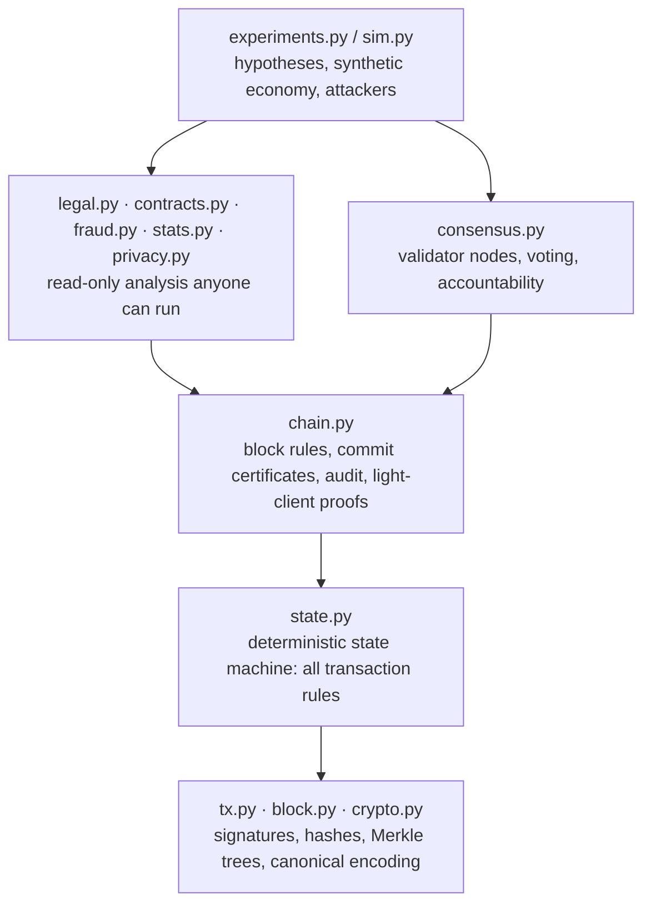

# Architecture

## Layers

The dependency arrows only point downward. Analysis code never writes to the ledger; consensus code never interprets economics.

## Data structures

**Transaction** (`jurisledger/tx.py`): `chain_id`, `kind`, `sender` (Ed25519 public key, hex), `nonce`, `payload`, `signature`. The transaction identifier is the SHA-256 hash of the canonical encoding of everything except the signature.

**Block header** (`jurisledger/block.py`): `chain_id`, `height`, `round`, `prev_hash`, `tx_root` (Merkle root of transaction identifiers), `state_root` (digest of the full state after the block), `proposer`.

**Block**: header, transactions, and `votes` — the commit certificate mapping validator address to a signature over `(chain_id, height, round, block_hash)`.

**State** (`jurisledger/state.py`): accounts (name, role, sector, balance, nonce), contracts, the access log and its rolling digest, the validator list, the slashed list, pending governance votes.

## The six block rules

A block is accepted by `Chain.add_block` only if:

1. it extends the current tip (`height`, `prev_hash`);
2. its proposer is `validators[(height + round) % n]`;
3. `tx_root` matches the transactions;
4. every transaction applies cleanly, in order;
5. the resulting state digest equals `state_root`;
6. it carries valid votes from at least `floor(2n/3) + 1` validators of the set in force at the parent block.

Rules 1 to 5 are checked by every validator *before voting*. Rule 6 is checked by everyone *before accepting*. `Chain.audit(genesis, blocks)` re-runs all six over an entire history.

## Design decisions

| Decision | Why | Alternative rejected |
|---|---|---|
| Permissioned Byzantine-fault-tolerant quorum, not proof of work | Finality in one block, negligible energy, validators are accountable legal entities; "freedom from a central authority" is achieved by *plurality* of validators | Proof of work: probabilistic finality and energy cost with no benefit when participants are identifiable. Single operator: the problem we are trying to remove |
| Account model with nonces | Balances and national accounts map naturally to accounts; replay protection is one integer | Unspent-transaction-output model: better privacy, awkward for per-entity statistics |
| Purpose tags validated against registered roles | Turns statistics into sums and blocks the cheapest mis-reporting | Free-text memos: unusable for statistics. Post-hoc classification by machine learning: opaque and contestable |
| Integer money, floats forbidden in canonical data | Every node must hash identical bytes | Decimal strings: workable, more parsing surface |
| Contract prose off-chain, hash on-chain | Erasure rights, confidentiality, size | Prose on-chain: permanent publication of private agreements |
| Access log as signed transactions, enforced by the vault | A log the reader signs cannot be forged by the host or denied by the reader | Server-side logs: editable by whoever runs the server |
| Supersession, never deletion | Courts and auditors need the version that was in force on a given day | Mutable contracts: destroys evidentiary value |
| Unpaired Merkle nodes are promoted, with leaf/node domain separation | Avoids the duplicate-leaf mutation (CVE-2012-2459) and second-preimage tricks | Bitcoin-style duplication |
| Equivocation evidence is a transaction anyone can submit | Accountability needs no trusted prosecutor | Off-chain complaints |
| Mempool keeps only transactions valid against the tip | Simple and deterministic for experiments | Fee markets and eviction policies: out of scope |

## Extending the framework

- **New transaction kind:** add a constant in `tx.py`, a handler in `State`, validate fully before mutating, add tests that the state root is unchanged on failure.
- **New detector:** a pure function over `Chain` returning a list of dictionaries; add an injected-fraud case and a clean-baseline count to `exp_fraud`.
- **New attacker:** add a behaviour string in `consensus.py`, implement its `propose`/`on_proposal` deviation, and write down the claim it is expected to fail to break.
- **Real networking:** `Network` is the only simulated component. Replacing it with a gossip layer and a two-phase vote is the first roadmap item.
