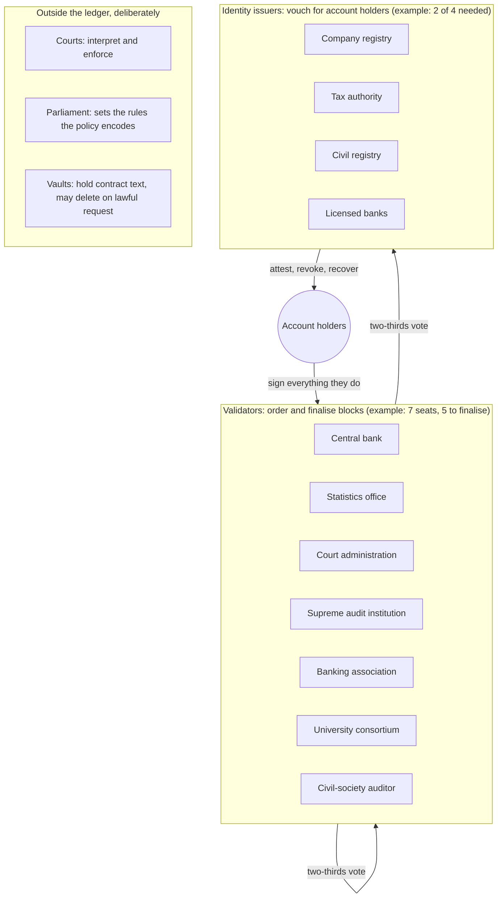

# Blueprint for public-sector use

What it would take to run JurisLedger as shared infrastructure for a state: a register of contracts, a settlement record, and a source of official statistics. Written to be argued with. Nothing here is a claim that the prototype is ready; the last section lists what is missing.

## 1. The three design goals, and how each is tested

| Goal | What it means here | Evidence in the repository |
|---|---|---|
| **Security** | No single institution, insider or network fault can forge, rewrite or fork the record; every privileged role has a short, checked list of powers | `attacks`, `asynchrony`, `integration`, `identity`, `disputes` experiments; `docs/THREAT_MODEL.md` |
| **Usability** | A clerk can read it, a lawyer can verify one contract offline, a citizen can recover a lost key, and errors say what to do next | `jurisledger demo`, `register.html`, `jurisledger verify`, recovery flow in `identity` |
| **Viability** | It keeps running when a third of validators fail, survives restarts and torn writes, can be audited by outsiders, and has an honest capacity figure | `storage.py`, `jurisledger audit`, `jurisledger bench`, crash-fault claims in `attacks` |

## 2. Who holds which role

The core rule: **no single interest may control one third of the validator seats or *k* of the identity issuers.** The experiments show exactly what breaks at those thresholds (two of four colluding validators fork the ledger; *k* colluding issuers can attempt an account takeover).

| Role | Can | Cannot | Removed by |
|---|---|---|---|
| Validator | Propose and vote on blocks; vote on validators and issuers | Spend from any account, alter a contract, finalise alone, sign two blocks in one round without losing its seat | Self-proving `EVIDENCE`, or a two-thirds vote |
| Identity issuer | Attest, revoke, co-request a recovery for accounts it attested | Verify anyone alone, move money, recover an account it never attested, act inside the veto window | Two-thirds vote of validators; its attestations stop counting at once |
| Arbitrator (per contract) | Reduce, postpone or waive a disputed obligation, once | Act uninvited, increase a debt, move money | Not applicable: chosen by the parties per contract |
| Account holder | Pay, contract, rotate key, veto a recovery | Use purpose tags outside its role, exceed the unverified cap | — |
| Anyone | Read public data, audit everything, submit evidence against a validator | — | — |

## 3. What a citizen or firm experiences

1. **Onboarding.** Install a wallet, generate a key, register. Small payments work immediately. Visiting (or being already known to) two issuers lifts the cap and allows contracts. The credentials themselves never touch the ledger.
2. **Contracting.** One party drafts; the text goes to a vault, its fingerprint to the ledger; every party signs the same fingerprint. Rent, instalments and fees can be listed as obligations so that "was it paid on time?" has a public answer.
3. **Disagreement.** If the contract names an arbitrator, either party opens a dispute; the obligation shows as *disputed*, not *overdue*. The award is public and bounded. Enforcement remains with the courts, which receive an evidence file they can check without trusting anyone.
4. **Losing the phone.** Two issuers who know the person request recovery to a new key. For the length of the waiting period the old key can cancel it; afterwards contracts, obligations and balances follow the new key automatically.
5. **Looking something up.** The register is one HTML file that can be archived, mirrored, printed or handed to a court, and it states how to re-check it.

## 4. Capacity

`jurisledger bench` on one laptop core, pure Python: roughly 7,000 validated transactions per second, 20,000 signatures per second, about 420 bytes per transaction uncompressed. Signature checks are independent, so validation scales with cores, and a compiled implementation is typically far faster than interpreted Python. A rough planning identity: *1,000 transactions per second sustained is about 86 million per day and about 13 terabytes per year at this encoding.* The consensus figure printed by the benchmark is low because four validators are simulated inside one process; it is not a network measurement. None of this replaces a load test on real hardware and links.

## 5. Phased rollout

| Phase | Scope | Exit test |
|---|---|---|
| A. Shadow register | Public procurement contracts only, mirrored from the existing system; no payments | Auditors reproduce the official procurement report from the ledger alone |
| B. Obligations | Government-to-business payments under those contracts tagged and tracked | Late-payment statistics match the treasury's within an agreed tolerance |
| C. Voluntary private use | Firms may register contracts and receivables; banks check for double pledging | A double-pledging attempt is caught in a supervised exercise |
| D. Statistics | The statistics office publishes an experimental ledger-based indicator beside the official one | Revisions history shows where and why they differ |
| E. Broad settlement | Only after a privacy layer with range proofs, an external security audit and legislation | Independent red-team report; data-protection authority sign-off |

Each phase is useful if the next never happens.

## 6. What must exist outside the code

- **Law.** Recognition of ledger records and evidence files; rules on who may be an issuer; liability for a negligent attestation; how erasure rights apply to vaults. See `docs/LEGAL.md`.
- **Governance charter.** How seats are allocated, rotated and funded; conflict-of-interest rules; what happens when the chain halts (by design it halts and does not guess when a third of validators are missing).
- **Key custody.** Hardware keys for validators and issuers; ceremonies; incident response. The protocol assumes keys are secret and says nothing about how.
- **Inclusion.** People without smartphones, legal guardianship, companies in liquidation, the deceased.

## 7. What is still missing in the software

1. Transport hardening: validators now run as processes over TCP (`jurisledger cluster`), but without TLS, peer authentication at the socket level, connection limits or peer discovery.
2. Confidential amounts with range proofs; today balances and counterparties are public, which no state should accept for general payments.
3. Finer time: block timestamps are validator-endorsed to within a five-minute tolerance; tighter guarantees need synchronised clocks.
4. Fees or quotas against spam.
5. Snapshots and pruning; the audit currently replays everything.
6. Formal verification of the state machine, and an external security review.
7. Accessibility and localisation of the register; wallet software.
